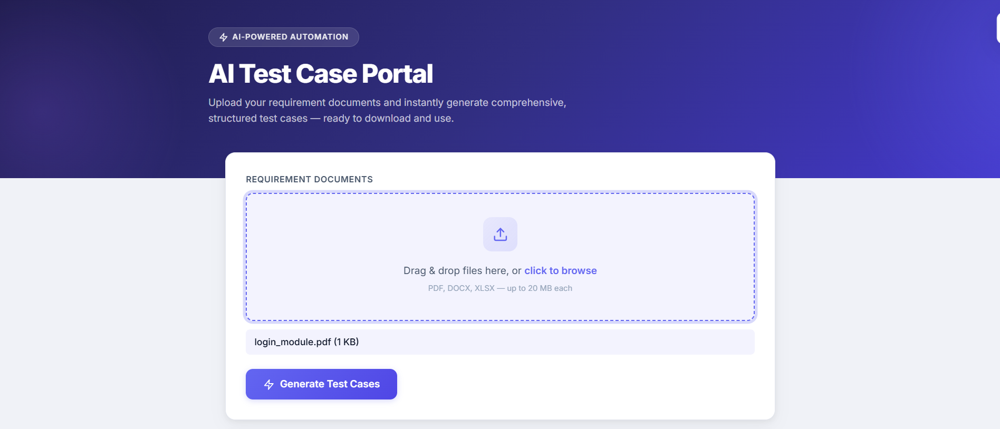
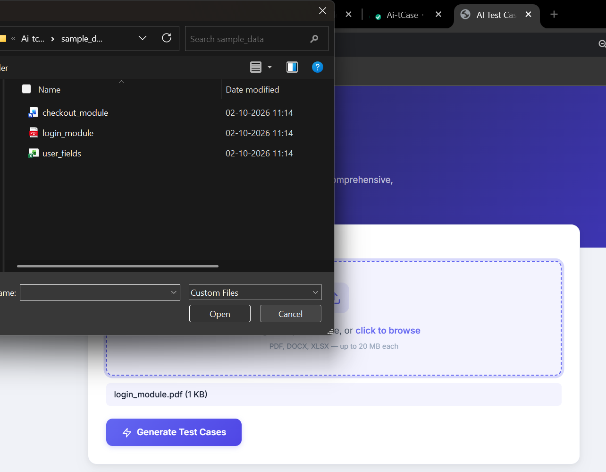
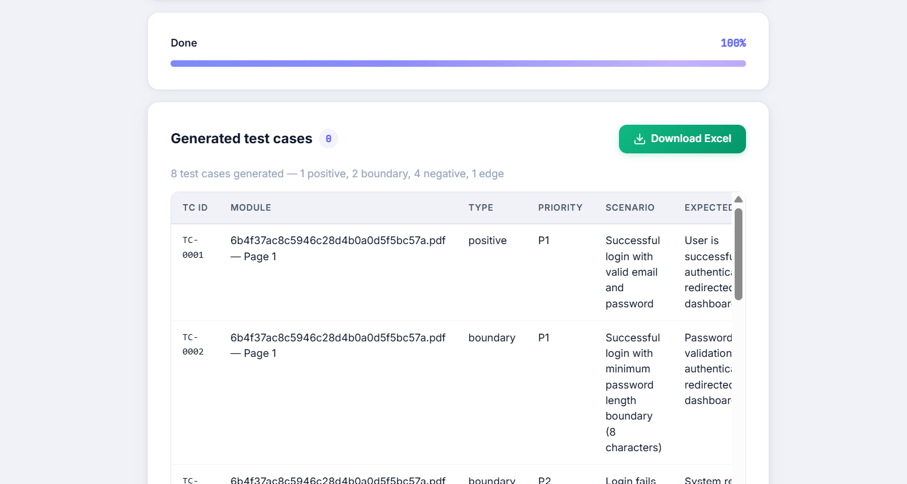

# AI Test Case Portal

Upload requirement documents (PDF, DOCX, or Excel) and get back a formatted
Excel workbook of generated test cases — positive, negative, boundary, and
edge — using retrieval-augmented generation (RAG) with Gemini.

Single FastAPI backend serves both the API and the frontend (plain HTML/JS,
no build step). One process, one port, no Docker required to run it.

## How it works

```
Upload (PDF/DOCX/XLSX)
   │
   ▼
Extraction  — PyMuPDF / python-docx / openpyxl → per-page/section/sheet text
   │
   ▼
Chunking    — splits into ~450-token chunks (keeps embedding + retrieval cheap)
   │
   ▼
Embedding   — Gemini text-embedding-004, one call per chunk
   │
   ▼
In-memory vector store — numpy cosine similarity (no external vector DB needed
                          for a single-session, one-document-at-a-time workflow)
   │
   ▼
RAG generation — per module/section: retrieve the top-K most relevant chunks
                  (including ones from *other* sections), generate test cases
                  with Gemini 2.0 Flash, JSON-only output
   │
   ▼
Excel export — OpenPyXL, Summary + Test Cases sheets, formatted & color-coded
```

### Why this design keeps token usage down

- **Chunked, not whole-document, prompts.** The LLM never sees the entire
  document at once — only the chunks relevant to the module currently being
  generated.
- **Retrieval, not concatenation.** Related context from elsewhere in the
  document is pulled in by embedding similarity, not by including every
  chunk in every prompt.
- **One generation call per module**, not per individual test case — fewer
  round trips, and the model generates several related test cases per call
  while context is already loaded.
- **JSON-only output with a capped `max_output_tokens`** — no wasted output
  tokens on prose/markdown explanation.
- **Gemini 2.0 Flash by default** — the cheaper/faster tier is enough for
  structured test-case generation; swap `GEMINI_GENERATION_MODEL` in `.env`
  if you need a stronger model for complex specs.

## Project layout

```
backend/
  app/
    config.py              # settings (env-driven)
    models.py               # Pydantic schemas (TestCase, Job, DocumentChunk)
    extraction.py            # PDF/DOCX/XLSX -> structured text sections
    chunking.py               # sections -> bounded chunks
    gemini_client.py           # the only module that talks to the Gemini API
    vector_store.py             # in-memory cosine-similarity search
    testcase_generator.py        # RAG orchestration + prompt
    excel_export.py               # OpenPyXL workbook builder
    jobs.py                        # in-memory job store + pipeline orchestration
    main.py                         # FastAPI app, routes, serves the frontend
  requirements.txt
  requirements-dev.txt
  .env.example
frontend/
  index.html          # upload UI, progress, results table, download
  app.js                # fetch calls, polling, rendering — no framework needed
  styles.css
tests/
  test_pipeline_integration.py   # full pipeline test, Gemini calls mocked
sample_data/
  login_module.pdf, checkout_module.docx, user_fields.xlsx   # for trying it out
```

## Run it locally

```bash
cd backend
python3 -m venv .venv
source .venv/bin/activate          # Windows: .venv\Scripts\activate
pip install -r requirements-dev.txt

cp .env.example .env
# Edit .env and set GEMINI_API_KEY (get one at https://aistudio.google.com/app/apikey)

uvicorn app.main:app --reload --port 8000
```

Then open **http://localhost:8000** in a browser — that's the frontend,
served by the same process. Upload a file from `sample_data/` to try it
without writing your own test document first.

## Run the tests

```bash
cd backend && source .venv/bin/activate
cd .. && pytest tests/ -v
```

The test suite mocks the Gemini API calls (embedding + generation) with
deterministic fakes, so it runs without a real API key and without network
access — but exercises every other part of the real pipeline: file upload,
extraction, chunking, the vector store, job state transitions, and the
actual Excel file produced. This is also why `tests/` sits at the project
root rather than under `backend/` — it imports the real sample documents
from `sample_data/`.

## API

| Method | Path | Purpose |
|---|---|---|
| `GET` | `/api/health` | Liveness check |
| `POST` | `/api/jobs` | Upload one or more files (`multipart/form-data`, field name `files`), starts a background job, returns `{job_id}` |
| `GET` | `/api/jobs/{job_id}` | Poll job status/progress; once `completed`, includes the generated `test_cases` |
| `GET` | `/api/jobs/{job_id}/download` | Download the generated Excel workbook |

## Notes on scope

- **Job storage is in-memory** — restarting the server clears job history.
  Fine for a single-user/local tool; swap `app/jobs.py`'s dict for Redis or
  a DB table if this needs to survive restarts or run across multiple
  processes.
- **No auth** — add it in front of `/api/jobs*` if this is exposed beyond
  localhost.
- **No Docker** — per your request, this is left as a plain Python app for
  now. A `Dockerfile`/`docker-compose.yml` can be added back in later
  without changing any of the above.











